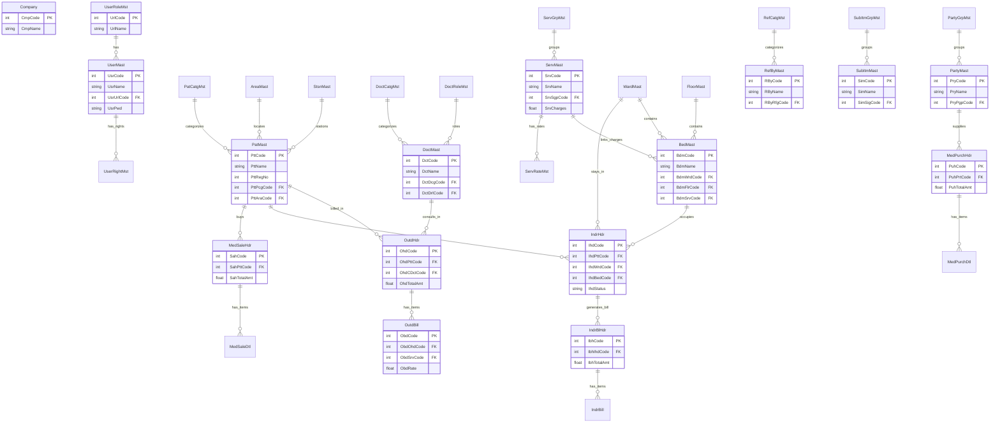

# Star HMS (Hospital Management System)

A comprehensive, fully modernized Hospital Management System (HMS) built to replace legacy Microsoft Access systems while maintaining a highly performant, traditional desktop-like interface. 

This project bridges legacy workflows into a modern web ecosystem using **React (Next.js)** on the frontend and **Python (FastAPI) + PostgreSQL** on the backend.

---

## 🏗️ Architecture & Technology Stack

- **Frontend**: Next.js 16 (React) with standard `ag-grid-community` for complex data grids.
- **Styling**: Pure CSS (`forms.css`, `layout.css`, `globals.css`). The UI purposefully avoids utility classes like TailwindCSS to enforce a traditional, dense, and plain software aesthetic typical of enterprise hospital systems.
- **Backend**: FastAPI (Python 3.13) paired with SQLAlchemy 2.0 ORM.
- **Database**: PostgreSQL for robust relational data integrity and transaction handling.
- **Legacy Integration**: Node.js ADODB sync agent (`_legacy/apps/sync-agent`) configured to bridge data from older Microsoft Access (`.mdb`) files to the new cloud infrastructure.

## 📦 System Modules

The application is structured into interconnected operational modules:

### 1. Hospital Masters
Core infrastructure setup for the entire hospital ecosystem.
- **Directories**: Doctors, Patient Categories, Wards, Floors, Beds, and Diagnostic Services.
- **Features**: Complete CRUD operations, real-time mapping, and logical deletion states.

### 2. Outpatient Department (OPD)
Handling day-to-day ambulatory patient visits.
- **Registration**: Auto-generation of patient codes and consultation vouchers.
- **Billing**: Multi-service grid billing with dynamic discount percentages and doctor share calculators.

### 3. Indoor Patient Department (IPD)
Managing complex inpatient hospital stays.
- **Admissions**: Reserving beds and establishing care links with specific consultants.
- **Bed Census**: Live visual dashboard of occupied vs available beds across all wards.
- **IPD Billing**: Automatic daily boarding charge accruals and complex discharge billing.

### 4. Pharmacy & Diagnostic Lab
Inventory and ancillary revenue centers.
- **Pharmacy**: Supplier/Party masters, Drug/Item masters. Dynamic grids for Purchase Entry and Retail Sales.
- **Lab**: Diagnostic test mapping and lab service billing.

### 5. Administration & Reporting
Top-level auditing and oversight.
- **Collection Hub**: Unified dashboard querying and combining revenue streams from OPD, IPD, and the Lab based on configurable date ranges.

## 🚀 Getting Started

### 1. Backend Setup
Navigate to the `backend` directory, install requirements, and start the FastAPI server:

```bash
cd backend
pip install -r requirements.txt
python -m uvicorn app.main:app --reload
```
The backend API will be available at `http://localhost:8000`.

### 2. Frontend Setup
From the project root, install Node dependencies and run the Next.js development server:

```bash
npm install
npm run dev
```
The frontend application will be available at `http://localhost:3000`.

### 3. Sync Agent (Optional)
If running the legacy synchronization bridge:
```bash
cd _legacy/apps/sync-agent
npm install
npm run dev
```

## 🎨 UI/UX Philosophy

This project strictly adheres to a "desktop-software" paradigm on the web:
- **No Tailwind/Utility Clutter**: Components rely on standard `.form-control`, `.form-group`, and `.btn` semantic class names.
- **Density Over Whitespace**: Designed for rapid data entry by hospital administrators who prefer high information density over spaced-out consumer designs.
- **Summary/Detail Layouts**: Uniform master-detail views allowing users to seamlessly transition between looking at a grid of data and entering complex forms.

---
*Built to bring legacy hospital infrastructure into the modern web era.*

## 🗄️ Database Entity-Relationship Diagram

Below is the current relational data structure represented in an ER Diagram (Table Form) showing all key entities, attributes, and relationships.


